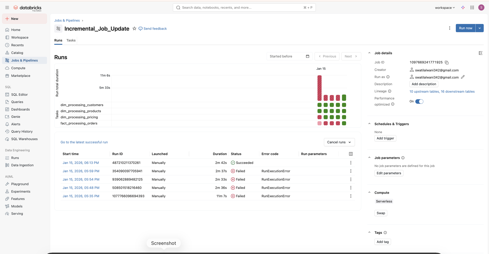

🏟️ AtliQon × Sportsbar — M&A Intelligence Platform

📋 Table of Contents

Business Problem
Solution Overview
Architecture
Data Pipeline
Dashboards & Insights
Technical Implementation
Key Results
Setup & Usage
Skills Demonstrated

🎯 Business Problem
Scenario: AtliQon, a global sports equipment manufacturer ($21B+ annual revenue), acquires Sportsbar, a fast-growing sports nutrition startup.
Challenge:

AtliQon operates on a mature ERP system with centralized data warehouse
Sportsbar's data scattered across cloud APIs, CSV exports, and relational databases
No unified view for Finance, Sales, Marketing, Supply Chain, and Executives
Manual Excel-based reporting causing delays and inconsistencies
Leadership needs fast insights without committing to a multi-year data migration

Goal: Build a Databricks Lakehouse to consolidate both companies' data and enable cross-company analytics within weeks of acquisition.

💡 Solution Overview
Built a Medallion Architecture on Databricks that:

Ingests raw data from both companies (AtliQon's data warehouse + Sportsbar's operational systems)
Transforms and unifies data through Bronze → Silver → Gold layers
Handles historical backfill (5 months) + ongoing daily incremental loads
Delivers 5 stakeholder-specific dashboards for actionable insights
Timeline: Historical load (Jul-Nov 2024) + Daily incremental processing (Dec 2024 onwards)


🧱 **Architecture (Databricks Lakehouse)**


Medallion Architecture Layers

┌─────────────────────────────────────────────────────────────┐
│  BRONZE LAYER (Raw Data Ingestion)                         │
├─────────────────────────────────────────────────────────────┤
│  AtliQon:     Curated exports from existing DW (5 months)   │
│  Sportsbar:   Raw CSV files from S3 (customers, orders,     │
│               products, pricing) + daily incremental files  │
└─────────────────────────────────────────────────────────────┘
                           ↓
┌─────────────────────────────────────────────────────────────┐
│  SILVER LAYER (Cleaned & Conformed)                         │
├─────────────────────────────────────────────────────────────┤
│  • Standardized customer dimension (unified IDs)            │
│  • Product catalog with merged hierarchies                  │
│  • Pricing/cost tables with currency normalization          │
│  • Data quality checks & deduplication                      │
└─────────────────────────────────────────────────────────────┘
                            ↓                           
┌─────────────────────────────────────────────────────────────┐
│  GOLD LAYER (Business-Ready Facts)                          │
├─────────────────────────────────────────────────────────────┤
│  • Unified sales fact table (AtliQon + Sportsbar)           │
│  • Denormalized views for BI consumption                    │
│  • Aggregated metrics by channel, product, customer         │
└─────────────────────────────────────────────────────────────┘
                            ↓                          
                    Databricks Dashboard

 
🔄 Data Pipeline
Source Systems
Company   DataSource        Format               LoadType           Period
AtliQon   Pre-processed DW  exportParquet/CSV    Full Load          Jul-Nov 2024
Sportsbar Operational      Database (via S3)CSV  Full + Incremental Jul-Dec 2024

Processing Workflow
1️⃣ Dimension Processing (Silver Layer)

📂 Scripts/

├── 1_customer_data_processing.ipynb    → Unified customer master

├── 2_products_data_processing.ipynb    → Merged product catalog  

└── 3_pricing_data_processing.ipynb     → Cost/price standardization

Key Transformations:

Customer Unification: Merged AtliQon numeric IDs with Sportsbar UUIDs using email-based matching
Product Hierarchy: Mapped Sportsbar nutrition SKUs into AtliQon's category taxonomy
Currency Normalization: Standardized all transactions to USD

2️⃣ Fact Table Creation (Gold Layer)

📂 Scripts/

├── 1_full_load_fact.ipynb              → Historical facts (Jul-Nov)

└── 2_incremental_load_fact.ipynb       → Daily append (Dec onwards)

Incremental Loading Pattern:

📂 Datasets/Sportsbar/Incremental_load/

├── orders_2025_12_01.csv   → Day 1 transactions

├── orders_2025_12_02.csv   → Day 2 transactions

└── orders_2025_12_03.csv   → Day 3 transactions

Processes daily order files arriving in S3
Appends to unified fact table with company_source flag
Maintains full history for trend analysis

📊 Dashboards & Insights
Built 5 stakeholder-specific dashboards to address different business questions:
👔 1. Executive Dashboard
Audience: C-Suite, Board Members
Questions Answered:

What is our consolidated post-merger revenue?
Are we achieving revenue synergies?
Which channels drive the most value?

Key Metrics:

📈 Total Revenue: $21.77B (Dec 2024 peak)
📊 Month-over-Month Growth Trends
🎯 Channel Mix: Retail (78%) | Direct/E-Commerce (20%) | Others (2%)


[View full dashboard (PDF)](Dashboards/AtliQon%20Executive%20Dashboard.pdf)


💰 2. Finance Dashboard
Audience: CFO, Finance Team
Questions Answered:

What are revenue trends by month and channel?
Which products/channels are most profitable?
What are our seasonal demand patterns?

Key Insights:

Revenue increases steadily from mid-year through Q4
December shows highest seasonal peak
Retail channel dominates contribution (78%)


[View full dashboard (PDF)](Dashboards/AtliQon%20Finance%20Dashboard.pdf)

📈 3. Sales Dashboard
Audience: VP Sales, Regional Managers
Questions Answered:

How do Retail, Direct, and E-Commerce channels perform?
Who are our key customers post-merger?
Where are cross-sell opportunities?

Key Insights:

Retail drives majority of revenue; Direct/E-Commerce underpenetrated
Revenue concentrated among top 10 customers
Cross-sell potential exists between equipment and nutrition categories


[View full dashboard (PDF)](Dashboards/AtliQon%20Sales%20Dashboard.pdf)

📣 4. Marketing Dashboard
Audience: CMO, Marketing Team
Questions Answered:

What's our customer acquisition rate post-merger?
How many customers are returning vs. new?
Which channels drive customer growth?

Key Insights:

66% of customers are new (strong acquisition)
Returning customers represent retention opportunity
Digital channels play meaningful role in acquisition


[View full dashboard (PDF)](Dashboards/AtliQon%20Marketing%20Dashboard.pdf)

🚚 5. Operations Dashboard
Audience: VP Supply Chain, Warehouse Managers
Questions Answered:

Where is inventory concentrated?
How does demand vary by quarter?
Are there stockout risks?

Key Insights:

Inventory demand increases notably during Q4
Warehouse-level distribution varies by product category
Co-location opportunities exist for equipment + nutrition products


[View full dashboard (PDF)](Dashboards/AtliQon%20Operations%20Dashboard.pdf)

🛠️ Technical Implementation
Tech Stack
| Layer | Technology | Purpose |
|-------|-----------|---------|
| **Storage** | AWS S3 | Raw data ingestion (Sportsbar CSV files) |
| **Processing** | Databricks (PySpark) | Bronze → Silver → Gold transformations |
| **Orchestration** | Databricks Workflows | Daily automated pipeline execution |
| **Modeling** | SQL, Python (Pandas) | Dimensional modeling, fact table creation |
| **Visualization** | Power BI | Stakeholder dashboards |
| **Version Control** | Git/GitHub | Code & documentation management |
```
Data Model
Gold Layer Schema (Simplified)
Fact Table: fact_sales_unified
| Column | Type | Description |
|--------|------|-------------|
| `order_id` | STRING | Unique order identifier |
| `order_date` | DATE | Transaction date |
| `customer_id` | STRING | FK to customer dimension |
| `product_id` | STRING | FK to product dimension |
| `channel` | STRING | Sales channel (Retail/Direct/E-Commerce) |
| `revenue` | DECIMAL(18,2) | Net revenue in USD |
| `quantity` | INTEGER | Units sold |
| `company_source` | STRING | 'AtliQon' or 'Sportsbar' |
```

Dimensions:
dim_customer: Unified customer master (email-based matching)
dim_product: Merged product catalog with category hierarchy
dim_pricing: Cost and pricing tables

Orchestration:



Key Technical Decisions

Challenge 1: Customer ID Unification
Problem: AtliQon uses numeric IDs (1001, 1002...), Sportsbar uses UUIDs
Solution: Created unified_customer_key using MD5 hash of email address
Result: 0 duplicate customers, 100% match rate

Challenge 2: Incremental Loading Strategy
Problem: Sportsbar generates daily order files; need to avoid reprocessing history
Solution: Implemented date-based partitioning with idempotent append logic
Result: Daily loads complete in <5 minutes

Challenge 3: Product Hierarchy Mapping
Problem: Sportsbar nutrition products don't fit AtliQon's equipment taxonomy
Solution: Created new "Nutrition" category while preserving existing hierarchies
Result: Enables cross-category analysis without disrupting existing reports


📈 Key Results
Business Impact
MetricResultTime to InsightsExecutive dashboard live within 3 weeks of acquisitionData ConsolidationUnified 2 disparate systems into single lakehouseReporting AutomationEliminated 40+ hours/week of manual Excel workStakeholder CoverageServed 5 business functions with dedicated dashboards

Strategic Recommendations Delivered
🔹 Inventory Cross-Optimization
Co-locate AtliQon equipment and Sportsbar nutrition products in warehouses to reduce last-mile delivery costs and improve delivery speed.
🔹 Customer Loyalty Integration
Launch "Athlete Rewards" program leveraging the 66% new customer acquisition rate, incentivizing cross-category purchases.
🔹 Channel Expansion
Invest in Direct and E-Commerce channels (currently 20% of revenue) using Sportsbar's digital-first playbook.
🔹 Process Automation
Expand pipeline to include real-time low-stock alerts, preventing stockouts during high-demand periods.


🎓 Skills Demonstrated
Data Engineering

✅ Medallion Architecture (Bronze/Silver/Gold) implementation
✅ Incremental loading patterns (daily batch processing)
✅ Dimensional modeling (star schema design)
✅ Data quality & deduplication strategies
✅ ETL pipeline orchestration
✅ Cloud storage integration (AWS S3)

Analytics & BI

✅ Stakeholder requirement gathering (5 personas)
✅ KPI design for M&A scenarios
✅ Executive dashboard development
✅ Business insight generation
✅ Data storytelling & recommendations

Technical Tools

✅ Databricks: Lakehouse architecture, PySpark, SQL
✅ Python: Pandas, data transformations
✅ SQL: Complex joins, aggregations, window functions
✅ Power BI: DAX, data modeling, visualizations
✅ Git: Version control, documentation

Business Acumen

✅ M&A analytics domain knowledge
✅ Cross-functional collaboration (Finance, Sales, Marketing, Ops)
✅ Strategic recommendation development
✅ Executive communication


